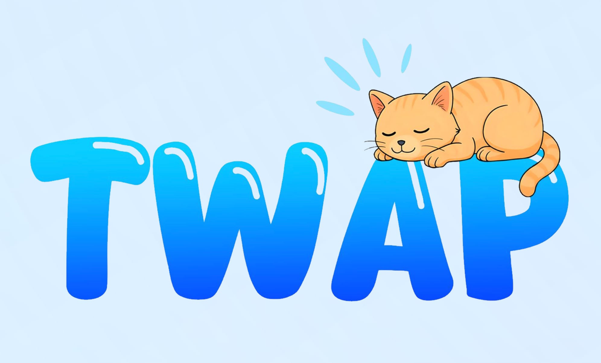

# Twap CLI

Welcome to Twap CLI, the fastest and easiest way to build your own custom command-line tools — no boilerplate or config required. In just a few twaps, you can create, run, and manage reusable CLI commands with ease.

## Table of Contents

- [1. Overview](#1-overview)
- [2. Features](#2-features)
- [3. How It Works](#3-how-it-works)
- [4. Getting Started](#4-getting-started)
- [5. Usage](#5-usage)
- [6. Ecosystem Metrics](#6-ecosystem-metrics)
- [7. Roadmap](#7-roadmap)
- [8. Community & Support](#8-community--support)
- [9. License](#9-license)
- [10. Mascot: Klibull](#10-mascot-klibull)

---

## 1. Overview

Twap CLI empowers developers and script lovers to instantly scaffold and run custom CLI commands from a simple JSON config file. No more messing with argument parsers or `bin` setup — just create, twap, and run.

---

## 2. Features

- ⚙️ **No-Boilerplate Setup**: Build a working CLI tool with a single config file and script folder.  
- ⚡ **twap create**: Instantly generate a new command script with just one line.  
- 📜 **twap list**: View all your available commands at any time.  
- 🔧 **JSON-based Configuration**: Easily register and organize your scripts via `twap.config.json`.  
- 🚀 **Plug-and-Play**: Works out of the box with Node.js, no dependencies required.

---

## 3. How It Works

1. **Install**  
   ```bash
   npm install -g @doxuta/twap
   ```

2. **Create**  
   ```bash
   twap create <name>
   ```

3. **Run**  
   ```bash
   twap <name>
   ```

4. **Manage**  
   ```bash
   twap list
   ```

---

## 4. Getting Started

### Prerequisites

- Node.js ≥ v14  
- `npm` or `yarn`

### Install via NPM

```bash
npm install -g @doxuta/twap
```

---

## 5. Usage

### Create a New Command

```bash
twap create greet
```

### List Available Commands

```bash
twap list
```

### Run a Command

```bash
twap greet
```

---

## 6. Ecosystem Metrics

- 📦 **Total Commands Deployed**: Updates as you run `twap create`.
- 🧩 **Local CLI Tooling**: Entire ecosystem is stored in a single folder.

---

## 7. Roadmap

- ✅ **v1.0**: Basic CLI command system with create, list, and config support.
- 🔜 **v1.1**: Command aliases, delete, and rename support.
- 🚧 **v2.0**: Plugin system and interactive CLI prompts.
- ✨ **v2.1**: CLI project templates (React, Express, etc.)
- 🧠 **Future**: Remote command registry, AI-assisted script generation.

---

## 8. Community & Support

- 📢 **Telegram**: [@twapCLIchannel](https://t.me/twapCLIchannel) *(coming soon)*
- 📚 **Documentation**: See `/docs` folder *(WIP)*
- 🐛 **GitHub Issues**: [Twap GitHub Repo](https://github.com/doxuta/twap/issues)

---

## 9. License

This project is released under the **MIT License**.

---

## 10. Mascot: Teki – The Regal Meme Whisperer of TWAP

<p align="center">
  
  <br/>
  
</p>

Why did we choose **Teki** as the mascot for **TWAP**?

Because only a cat with this much grace, sass, and perfectly crossed paws could represent the true spirit of meme culture on-chain.

- 😼 **Calm but Calculated**: Teki doesn't chase — Teki waits. Just like TWAP (Time-Weighted Average Pricing), Teki understands the art of timing.
- 🧠 **Sharp Gaze, Sharper Wit**: Behind those half-closed eyes is a tactical mind. Every meme minted on TWAP is judged silently by Teki’s unimpressed look of feline authority.
- 👑 **Meme Royalty Vibes**: Perched like a king on a throne (or a pillow-stool), Teki exudes the kind of chill power that every successful meme coin dreams of.
- 💡 **Symbol of Balance**: Meme creation needs edge and elegance. Teki’s zen aura captures both — a purring reminder that memes can move markets.

> 🌀 In a world of chaos, **Teki is the eye of the storm**.  
> The perfect mascot to represent the balance between **time-based strategy** and **meme-powered magic**.